# 🤖 EVA — Behaviour-Based Desktop Companion Robot

```text
███████╗██╗   ██╗██████╗ 
██╔════╝██║   ██║██╔══██╗
█████╗  ██║   ██║██████╔╝
██╔══╝  ╚██╗ ██╔╝██╔══██╗
███████╗ ╚████╔╝ ██║  ██║
╚══════╝  ╚═══╝  ╚═╝  ╚═╝
```

> **EVA V2 (Zen Companion)** is an autonomous, emotionally expressive desktop companion robot powered by the **ESP32 DevKit**. Built around an EMO-style continuous internal drive engine, EVA reacts organically to human touch, distance, time of day, and environmental stimuli using animated OLED eyes, procedural body movement, RGB mood lighting, and chiptune sound effects.

---

[](https://www.espressif.com/)
[](https://www.arduino.cc/)
[](https://www.adafruit.com/)
[](https://github.com/FluxGarage/RoboEyes)
[](apk/EVA-Companion.apk)
[](LICENSE)

---

## 📸 Photo Gallery & Visual Demonstrations

### 🤖 EVA Companion Hardware & Expressions

<p align="center">
  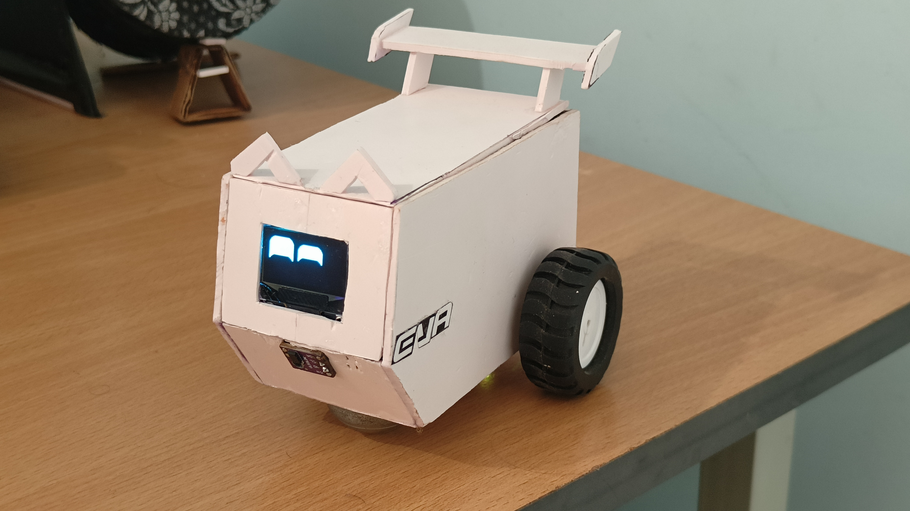
  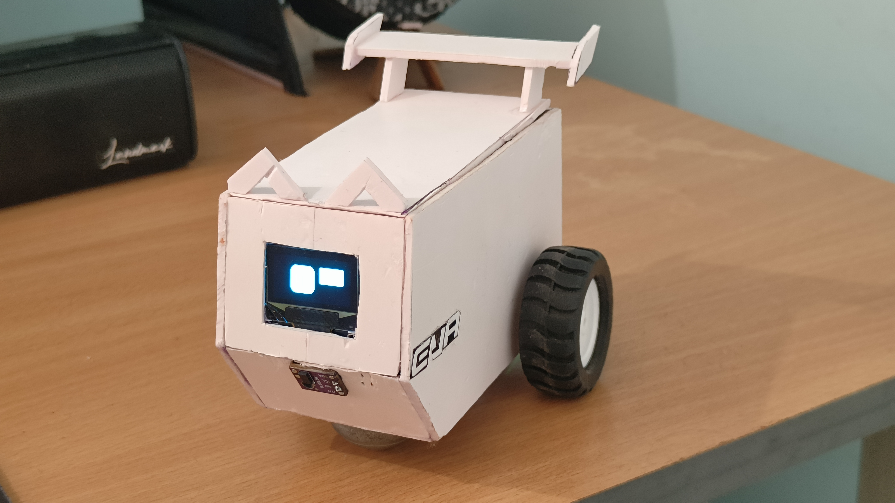
  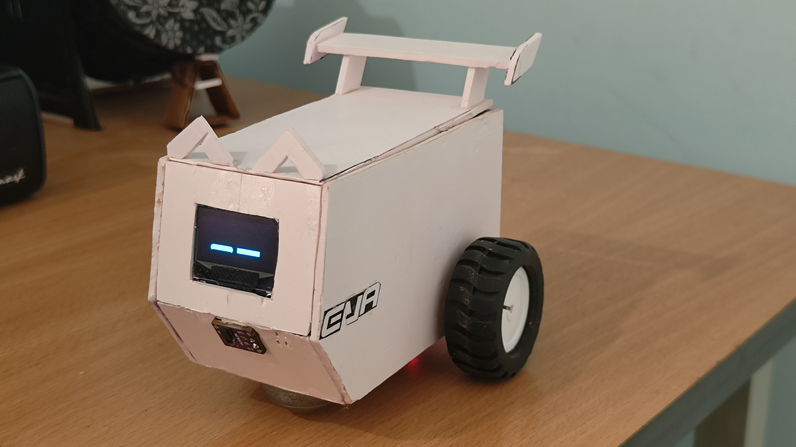
</p>

<p align="center">
  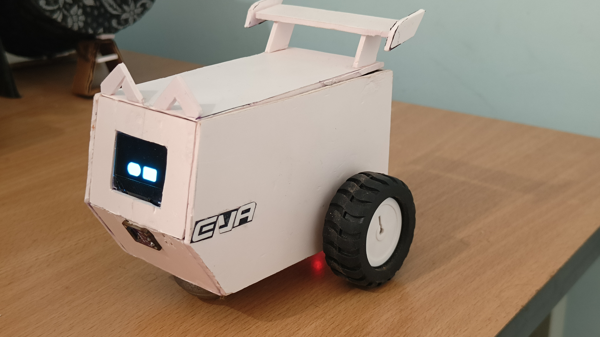
  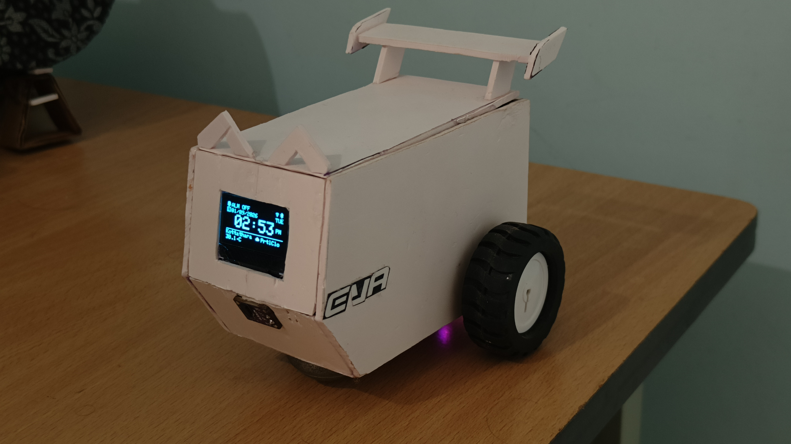
  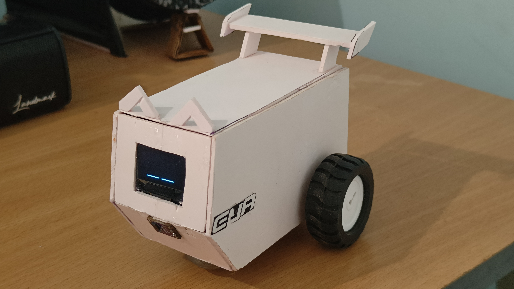
</p>

<p align="center">
  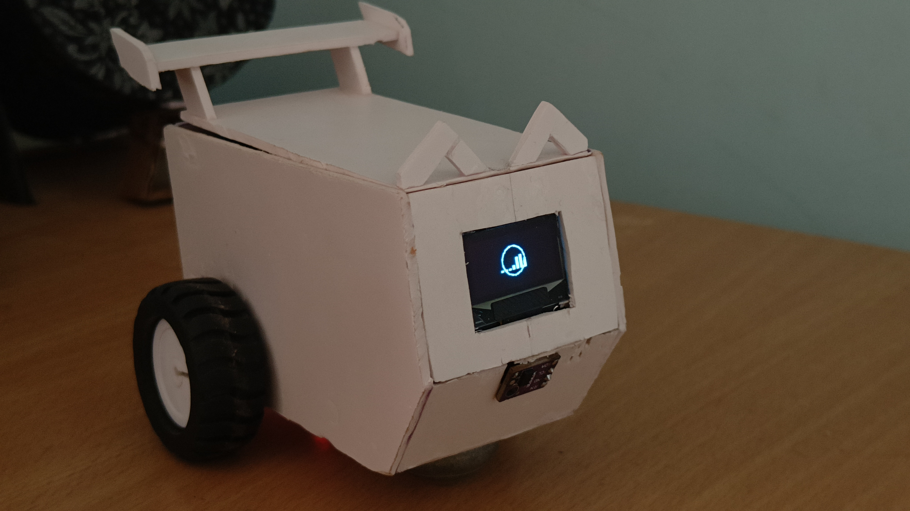
</p>

---

## 📑 Table of Contents

- [🤖 Project Vision \& Design Philosophy](#-project-vision--design-philosophy)
- [✨ Core Capabilities \& Personality Engine](#-core-capabilities--personality-engine)
  - [1. The 8 Expressive Eye Personalities](#1-the-8-expressive-eye-personalities)
  - [2. OLED Takeover Animations \& Interactive Mini-Games](#2-oled-takeover-animations--interactive-mini-games)
- [🧬 Software Architecture \& Control Pipeline](#-software-architecture--control-pipeline)
  - [Continuous Lifecycle Energy Engine](#continuous-lifecycle-energy-engine)
  - [Proportional Spatial Awareness \& Escape Logic](#proportional-spatial-awareness--escape-logic)
  - [Runtime Operating Modes](#runtime-operating-modes)
- [🔌 Hardware Specification \& Circuit Diagram](#-hardware-specification--circuit-diagram)
  - [Bill of Materials (BOM)](#bill-of-materials-bom)
  - [Authoritative ESP32 Pinout Mapping](#authoritative-esp32-pinout-mapping)
  - [System Circuit Schematic](#system-circuit-schematic)
- [📱 Android Companion App (APK)](#-android-companion-app-apk)
  - [📱 Companion App Screenshots](#-companion-app-screenshots)
  - [💡 Why We Migrated to a Native APK](#-why-we-migrated-to-a-native-apk)
  - [📲 How to Install \& Setup the Android App](#-how-to-install--setup-the-android-app)
  - [Bluetooth Command Protocol](#bluetooth-command-protocol)
- [⚙️ Configuration, Customization \& Build Guide](#️-configuration-customization--build-guide)
  - [1. Prerequisites](#1-prerequisites)
  - [2. Firmware Installation](#2-firmware-installation)
  - [3. Deep-Dive Customization Guide (`src/Config.h`)](#3-deep-dive-customization-guide-srcconfigh)
  - [4. Sensor Calibration](#4-sensor-calibration)
- [🤝 Open Source, License \& Usage Guidelines](#-open-source-license--usage-guidelines)
- [🙌 Credits \& Acknowledgments](#-credits--acknowledgments)
- [❓ FAQ \& Troubleshooting](#-faq--troubleshooting)

---

## 🤖 Project Vision & Design Philosophy

Most DIY desktop robots operate like basic obstacle-avoiding cars: a sensor reads a distance, triggers an `if` condition, executes a motor spin, and repeats. They feel mechanical and lifeless.

**EVA was engineered around a single strict design rule:**

> **Sensors do not directly trigger motors or display outputs.** Sensors feed information into an **Interpretation Layer**, which updates an internal **Continuous Lifecycle Engine**. The **Behaviour Engine** evaluates EVA's internal energy, social need, and environmental state to decide an action, while the **Emotion Engine** determines *how* EVA feels. Outputs (eyes, buzzer tone, RGB light, chassis movement) simply express that internal state.

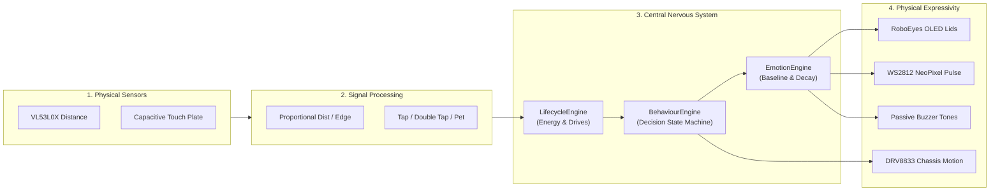

---

## ✨ Core Capabilities & Personality Engine

### 1. The 8 Expressive Eye Personalities

EVA V2 consolidates eye expressions into **8 distinct, instantly recognizable eye personalities**. Each personality dynamically re-configures FluxGarage RoboEyes parameters (lids height, autoblinker frequency, idle look-around speed, curiosity asymmetry, sweat, and horizontal flicker):

| Emotion | Lids / Mood | Autoblinker Rate | Look-Around | RGB Light | Audio Feedback |
| :--- | :--- | :--- | :--- | :--- | :--- |
| **`EVA_NEUTRAL`** | `DEFAULT` (calm, steady) | ~4s ± 2s | Medium (3s) | Solid Calm Blue | Silence |
| **`EVA_HAPPY`** | `HAPPY` (warm curved) | ~5s ± 2s | Soft (3s) | Solid Amber | Rising Chirp Up |
| **`EVA_EXCITED`** | `HAPPY` + Curiosity ON | Fast (~2s) | Rapid (1s) | Gold Fast Pulse | Excitation Chiptune |
| **`EVA_CURIOUS`** | `DEFAULT` + Asymmetric | Slow (~6s) | Focused (2s) | Cyan Pulse | Curious "Hmm?" Chirp |
| **`EVA_SCARED`** | `TIRED` (Wide Open) + Sweat/Flicker | Rapid (1s) | Frozen (OFF) | Sharp Red Pulse | Flinch Sequence |
| **`EVA_BORED`** | `TIRED` (Heavy Droopy Lids) | Very Slow (~9s) | Lazy (6s) | Dim Blue Fade | Silent Blip |
| **`EVA_SLEEPY`** | `TIRED` (Half-closed drooping) | Slowest (~12s) | Frozen (OFF) | Slow Purple Breath | Yawn Sound |
| **`EVA_AFFECTIONATE`**| `HAPPY` + Soft squint | Soft (~6s) | Gentle (5s) | Soft Pink Pulse | Purring Sequence |

---

### 2. OLED Takeover Animations & Interactive Mini-Games

When EVA remains stationary or is triggered via remote command, non-blocking bitmap animations replace the eye interface:

1. 🦖 **Dino Jump Mini-Game (`ANIM_DINO`)**: An interactive 25 FPS side-scrolling dinosaur jump game. EVA automatically jumps cacti in idle mode, or the user can manually play via the companion app's `JUMP` button!
2. 🏋️ **Workout Pullups (`ANIM_PULLUPS`)**: Animated stick-figure doing gym pullups.
3. 🎵 **Music Party (`ANIM_MUSIC`)**: Dynamic equalizer bars dancing to rhythmic music beats.
4. ❄️ **Snowfall (`ANIM_SNOW`)**: Procedural particle snowfall animation across the OLED display.
5. 🚗 **Car Cruise (`ANIM_CAR`)**: Side-scrolling retro car driving animation.

---

## 🧬 Software Architecture & Control Pipeline

### Continuous Lifecycle Energy Engine

EVA operates on an energy cycle managed by `LifecycleEngine.h`. Rather than relying on rigid static timers, EVA's mood and desire to sleep evolve according to energy depletion and interaction boosts:

```text
       ┌───────────┐       Energy > 0.85       ┌───────────┐
       │  WAKING   │ ────────────────────────> │  ACTIVE   │
       │ (Groggy)  │                           │(Energetic)│
       └───────────┘                           └─────┬─────┘
             ▲                                       │ Energy < 0.60
             │                                       ▼
       ┌───────────┐                           ┌───────────┐
       │ SLEEPING  │                           │  CONTENT  │
       │ (Resting) │                           │  (Calm)   │
       └─────▲─────┘                           └─────┬─────┘
             │ Energy < 0.15                         │ Energy < 0.35
             │ (Confirmed)                           ▼
       ┌───────────┐                           ┌───────────┐
       │  DROWSY   │ <──────────────────────── │   BORED   │
       │(Heavy Eye)│       Energy < 0.25       │(Lazy Glum)│
       └───────────┘                           └───────────┘
```

- **Energy Decay**: Energy drains continuously while awake (`ENERGY_DECAY_RATE_PER_S = 0.00150f`).
- **Interaction Boost**: Tapping grants `+0.06` energy; sustained petting grants `+0.13` energy.
- **Sleep Threshold**: When energy drops below `0.15f`, EVA begins winding down and transitions to `MODE_SLEEP`.

---

### Proportional Spatial Awareness & Escape Logic

In EVA V2, movement is driven by the VL53L0X Time-of-Flight distance sensor providing continuous raw millimeter distance (`rawDistanceMm`):

```text
Distance > 500mm   →  Open Space   → Energetic Wander (Full Speed)
300mm – 500mm      →  Approach Zone → Slow Curious Crawl (Curious Eyes)
150mm – 300mm      →  Curve Zone    → Gentle Steering Curve
< 120mm            →  Obstacle Zone → Proportional Flinch & Turn
< 600mm Drop-Off   →  Edge Hazard   → Immediate Backward Flinch + 180° Spin
```

#### 🛠️ Anti-Stuck "Trapped Escape" Algorithm
1. Memory tracking `consecutiveObstacles`.
2. Alternating turn directions deterministically on each retry.
3. Increasing turn duration by `+120ms` per consecutive retry.
4. Triggering a **Trapped Escape Maneuver** (600ms firm reverse + 180° spin) after 5 consecutive failed turn attempts.

---

### Runtime Operating Modes

1. **`MODE_EVA` (Autonomous Companion Life)**: Full autonomous exploration, environmental awareness, emotional state transitions, and ToF proportional movement.
2. **`MODE_PET` (Resting / Touch-Only State)**: Motors are safely locked. EVA stays resting on your desk, responding only to touch and petting with sweet eyes and purring tones.
3. **`MODE_CLOCK` (Desktop Clock & Weather)**: OLED displays digital time, date, alarm status, and real-time weather fetched over Wi-Fi from Open-Meteo.
4. **`MODE_SLEEP` (Low-Power Sleep)**: Display turns off, motors lock, and energy recharges. Periodic clock peeks occur every 5 minutes.
5. **`MODE_RC` (Bluetooth Remote Control)**: Autonomous engine pauses; direct chassis manual driving and custom emotion/animation triggering are activated via Bluetooth.

---

## 🔌 Hardware Specification & Circuit Diagram

### Bill of Materials (BOM)

| Component | Quantity | Model / Description | Notes |
| :--- | :---: | :--- | :--- |
| **Microcontroller** | 1 | ESP32 DevKit V1 / ESP32-WROOM-32 | 240MHz Dual-Core, Wi-Fi & Bluetooth SPP |
| **Display** | 1 | 0.96" I2C SSD1306 OLED (128×64) | Address `0x3C`, I2C Bus |
| **Distance Sensor** | 1 | VL53L0X Time-of-Flight (ToF) Sensor | Address `0x29`, Angled downward |
| **Motor Driver** | 1 | DRV8833 Dual H-Bridge Driver | 4 PWM Input Channels |
| **Motors** | 2 | N20 DC Geared Motors (6V 300RPM) | Open-loop speed control |
| **Touch Sensor** | 1 | Capacitive Copper Plate / Foil | ESP32 `touchRead()` on GPIO 4 |
| **Mood Light** | 1 | WS2812B NeoPixel RGB LED | Single/Short Strip on GPIO 27 |
| **Audio Output** | 1 | 5V Passive Piezo Buzzer | LEDC PWM driven on GPIO 14 (Channel 4) |
| **Power Supply** | 1 | 18650 Li-Ion Battery + 5V Boost Module | Dual power rail (3.3V Logic / 5V Motors) |

---

### Authoritative ESP32 Pinout Mapping

Centralized strictly inside [`src/Config.h`](src/Config.h):

```text
 ┌────────────────────────────────────────────────────────────────────────┐
 │                      AUTHORITATIVE ESP32 PINOUT MAP                    │
 ├───────────────────┬───────────┬────────────────────────────────────────┤
 │ Peripheral        │ GPIO Pin  │ Hardware Function / Channel            │
 ├───────────────────┼───────────┼────────────────────────────────────────┤
 │ I2C SDA           │ GPIO 21   │ Shared Bus (OLED + VL53L0X ToF)        │
 │ I2C SCL           │ GPIO 22   │ Shared Bus (OLED + VL53L0X ToF)        │
 │ Motor Left Fwd    │ GPIO 25   │ DRV8833 IN1 (LEDC PWM Channel 0)       │
 │ Motor Left Rev    │ GPIO 26   │ DRV8833 IN2 (LEDC PWM Channel 1)       │
 │ Motor Right Rev   │ GPIO 32   │ DRV8833 IN3 (LEDC PWM Channel 2)       │
 │ Motor Right Fwd   │ GPIO 33   │ DRV8833 IN4 (LEDC PWM Channel 3)       │
 │ Touch Plate       │ GPIO 4    │ Touch0 (`touchRead()` Capacitive Input)│
 │ WS2812 NeoPixel   │ GPIO 27   │ FastLED / NeoPixel Data Line DIN       │
 │ Passive Buzzer    │ GPIO 14   │ LEDC PWM Tone (LEDC Channel 4)         │
 │ Expansion Servo   │ GPIO 13   │ Optional SG90 Servo (Disabled)         │
 └───────────────────┴───────────┴────────────────────────────────────────┘
```

---

### System Circuit Schematic

<p align="center">
  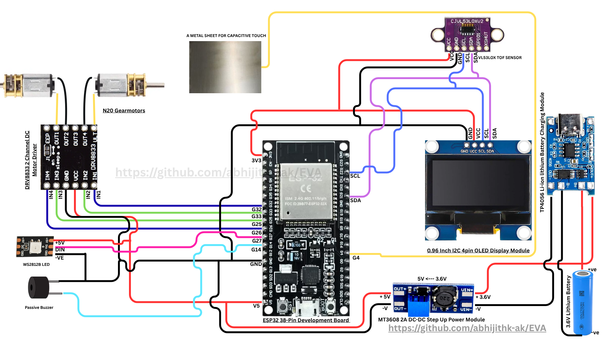
</p>

---

## 📱 Android Companion App (APK)

- **Pre-Compiled APK**: Ready-to-install binary is available at [`/apk/EVA-Companion.apk`](apk/EVA-Companion.apk).
- **Source Code**: Android Studio project files are located in [`/android_app_src`](android_app_src/).

---

### 📱 Companion App Screenshots

<p align="center">
  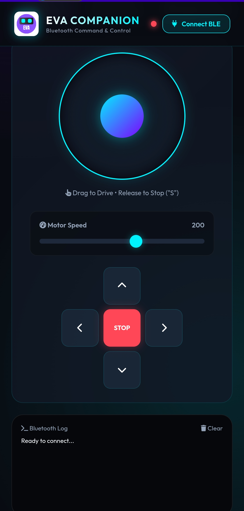
  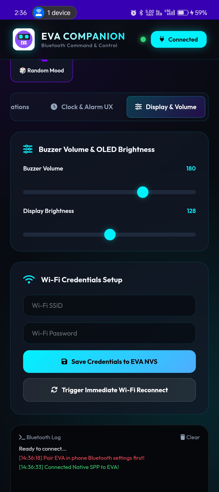
  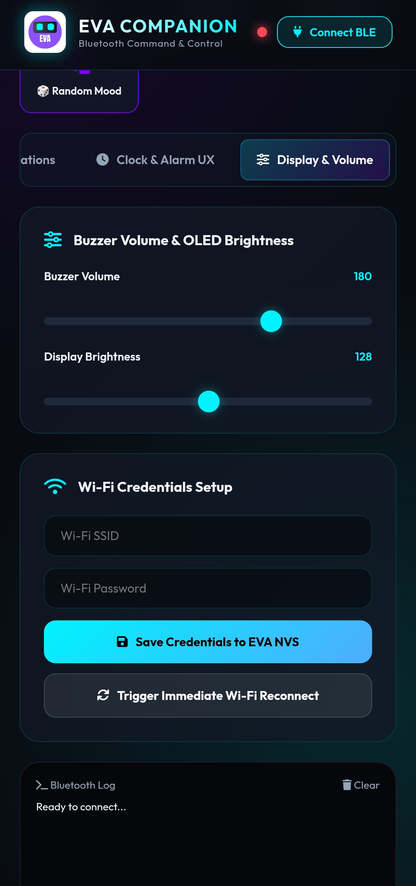
</p>

<p align="center">
  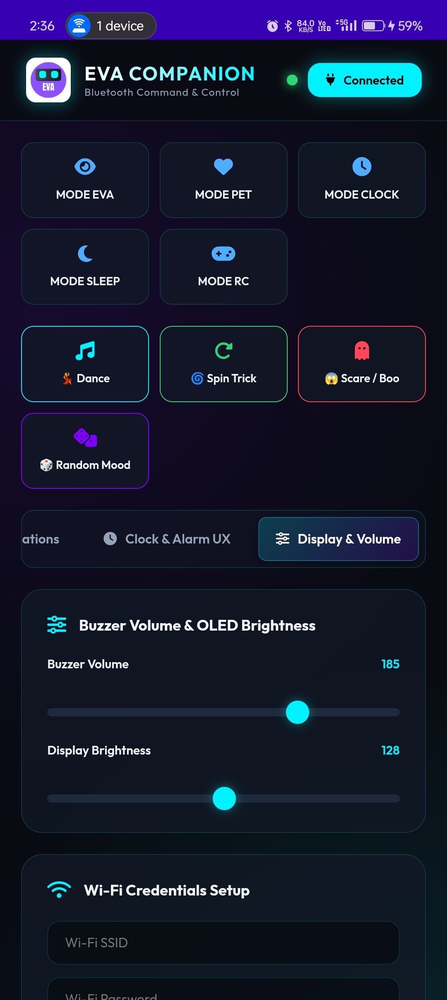
  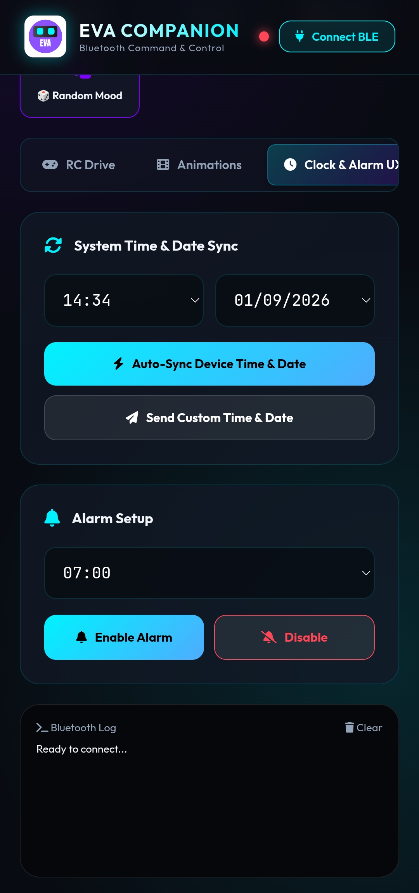
  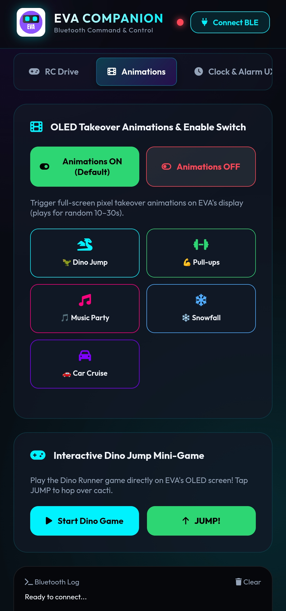
</p>

---

### 💡 Why We Migrated to a Native APK

During early testing, remote control via a standard website was evaluated. However, we **completely abandoned the web controller and moved to a native Android APK** due to browser Bluetooth limitations:

1. **Protocol Mismatch (Classic BT SPP vs. Web Bluetooth BLE)**:
   - ESP32's `BluetoothSerial.h` library runs **Classic Bluetooth SPP (Serial Port Profile / RFCOMM `00001101-0000-1000-8000-00805F9B34FB`)**.
   - Mobile web browsers (Chrome, Safari, Edge) **ONLY support Bluetooth Low Energy (BLE / GATT)**. Web browsers actively block raw Classic Bluetooth SPP socket connections.
2. **The Native APK Solution**:
   - The Android app invokes Android's native `BluetoothAdapter` and `BluetoothSocket` APIs directly, guaranteeing zero-latency RFCOMM streaming and instant pairing.

---

### 📲 How to Install & Setup the Android App

1. **Download APK**: Download [`EVA-Companion.apk`](apk/EVA-Companion.apk) from the [`/apk`](apk/) directory onto your Android device.
2. **Pair Bluetooth**: Power on EVA. Go to Android **Settings → Bluetooth**, scan for nearby devices, and pair with **`EVA`**.
3. **Allow Unknown Sources**: Enable *"Install Unknown Apps"* in Android Security settings for your File Manager if prompted.
4. **Install APK**: Tap **`EVA-Companion.apk`** and select **Install**.
5. **Launch & Connect**: Open **EVA Robot**, grant Bluetooth permissions, and tap **Connect**.

---

### Bluetooth Command Protocol

All commands sent to `CommsHub` are string-based packets or single drive characters:

#### 1. Instant Drive Characters:
- `'F'` : Drive Forward | `'B'` : Drive Backward | `'L'` : Pivot Left | `'R'` : Pivot Right
- `'G'` : Curve Left | `'I'` : Curve Right | `'H'` : Slow Curve Reverse | `'J'` : Slow Curve Forward
- `'S'` : Stop Motors Immediately | `'0'`–`'9'` : Set Motor PWM Speed (0=120, 9=255)

#### 2. Text Commands:
| Command String | Description | Example |
| :--- | :--- | :--- |
| `MODE <MODE>` | Switch operating mode | `MODE EVA`, `MODE PET`, `MODE CLOCK`, `MODE SLEEP`, `MODE RC` |
| `EMOTION <NAME>` | Trigger emotion profile | `EMOTION HAPPY`, `EMOTION EXCITED`, `EMOTION SCARED` |
| `TIME HH:MM` | Set manual clock time | `TIME 14:30` |
| `DATE DD/MM/YYYY` | Set manual date | `DATE 25/12/2026` |
| `ALARM HH:MM <ON/OFF>`| Set or disable daily alarm | `ALARM 07:00 ON`, `ALARM OFF` |
| `WIFI <SSID> <PASS>` | Save Wi-Fi configuration | `WIFI MyHomeNetwork SecretPass123` |
| `V <0-255>` | Set buzzer volume | `V 200` |
| `T <0-255>` | Set OLED display contrast/brightness | `T 250` |
| `DANCE` / `TRICK` | Start procedural dance routine / wiggle trick | `DANCE` |
| `ANIM <DINO/WORKOUT/PARTY/SNOW/CAR>` | Trigger OLED takeover animation | `ANIM DINO` |
| `GAME <DINO/JUMP>` | Start Dino game / Impulse jump action | `GAME DINO`, `GAME JUMP` |

---

## ⚙️ Configuration, Customization & Build Guide

### 1. Prerequisites

- **IDE**: [Arduino IDE 2.x](https://www.arduino.cc/en/software) or VS Code with PlatformIO.
- **Board Package**: ESP32 Arduino Board Manager (`https://raw.githubusercontent.com/espressif/arduino-esp32/gh-pages/package_esp32_index.json`).
- **Target Board**: `ESP32 Dev Module`.

---

### 2. Firmware Installation

1. Clone the repository:
   ```bash
   git clone https://github.com/abhijithk-ak/EVA.git
   cd EVA
   ```
2. Create your local config file:
   ```bash
   cp src/Config.example.h src/Config.h
   ```
3. Open `src/EVA.ino` in Arduino IDE.
4. Edit `src/Config.h` to set your Wi-Fi credentials:
   ```cpp
   #define WIFI_SSID           "Your_WiFi_SSID"
   #define WIFI_PASSWORD       "Your_WiFi_Password"
   #define WEATHER_LATITUDE    "10.93"
   #define WEATHER_LONGITUDE   "76.62"
   #define GMT_OFFSET_SEC      19800  // GMT+5:30 (India)
   ```
5. Connect your ESP32 via USB and click **Upload**.

---

### 3. Deep-Dive Customization Guide (`src/Config.h`)

All robot behavior, energy decay rates, sensor sensitivities, motor speeds, and display/audio parameters are configured in [`src/Config.h`](src/Config.h):

#### 🔋 A. Lifecycle Engine & Sleep Customization
- **`ENERGY_DECAY_RATE_PER_S`**: Rate at which EVA's energy depletes per second (`0.00150f`). Increase (e.g. `0.0050f`) for faster sleep cycles, or decrease (e.g. `0.0008f`) for all-day active operation.
- **`ENERGY_SLEEP_THRESHOLD`**: Below this energy level (`0.15f`), EVA enters drowsy mode and prepares for sleep.
- **`ENERGY_WAKE_BOOST`**: Energy restored immediately upon waking from sleep (`0.85f`).
- **`CURIOSITY_RISE_RATE_PER_S`**: Rate at which EVA's desire to look around rises when standing still (`0.008f`).
- **`SOCIAL_RISE_RATE_PER_S`**: Rate at which EVA's desire for touch builds when alone (`0.002f`).

#### 📐 B. Spatial ToF Distance Customization
- **`TOF_OBSTACLE_MM`**: Distance in mm (`95`) below which EVA detects an obstacle and triggers a startled flinch turn.
- **`TOF_EDGE_MM`**: Distance in mm (`150`) above which EVA detects a table edge drop-off and backs away.
- **`TOF_EDGE_CONFIRM_SAMPLES`**: Number of consecutive samples (`3`) required before confirming an edge event to prevent false drops.

#### 👈 C. Capacitive Touch Sensitivity Customization
- **`PIN_TOUCH`**: ESP32 Touch pin (`GPIO 4` / Touch0).
- **`TOUCH_TRIGGER_RATIO`**: Dynamic multiplier against baseline (`0.78f`). Lower (e.g. `0.70f`) reduces sensitivity; higher (e.g. `0.85f`) increases sensitivity.
- **`TOUCH_TRIGGER_DELTA`**: Threshold delta (`200`) required for tap classification.
- **`TOUCH_PET_MIN_MS`** / **`TOUCH_LONG_HOLD_MS`**: Petting duration (`1100ms`–`5000ms`) and sleep hold threshold (`5000ms`).

#### 🏎️ D. Motor Speed & Timing Customization
- **`MOVE_DEFAULT_SPEED`**: Default cruising duty cycle (`200` out of 255).
- **`MOVE_TURN_SPEED`**: Pivot turn duty cycle (`190` out of 255).
- **`MOVE_FORWARD_MS`** / **`MOVE_TURN_MS`**: Timed move duration (`700ms`) and turn duration (`450ms`).

#### 💡 E. Display Brightness & Buzzer Volume
- **`DISPLAY_BRIGHTNESS`**: SSD1306 OLED hardware contrast register (`250` out of 255).
- **`BUZZER_VOLUME`**: Passive buzzer LEDC PWM duty cycle cap (`250` out of 255).

---

### 4. Sensor Calibration

Because sensor mounting angles and chassis dimensions vary, calibrate these values in `src/Config.h`:

- **VL53L0X ToF Distance Calibration**:
  ```cpp
  #define TOF_OBSTACLE_MM      95   // Reading < 95mm = obstacle ahead
  #define TOF_EDGE_MM          150  // Reading > 150mm (when angled down) = edge drop-off
  ```
- **Capacitive Touch Sensitivity**:
  ```cpp
  #define TOUCH_TRIGGER_RATIO  0.78f // Sensitivity multiplier against dynamic baseline
  #define TOUCH_TRIGGER_DELTA  200   // Raw threshold delta
  ```

---

## 🤝 Open Source, License & Usage Guidelines

EVA is shared under the **MIT License with Non-Commercial Condition** (see [`LICENSE`](LICENSE)):

- 🟢 **Allowed**: Free for personal, educational, research, and non-commercial maker projects. You are free to view, modify, build, and adapt the code and hardware for your own personal use.
- 🤝 **Contributions**: Community contributions (pull requests, bug fixes, custom eye animations, and 3D chassis designs) are warmly welcomed!
- 🔴 **Commercial Restriction**: The software, hardware schematics, and derived works **MAY NOT be sold, resold, leased, or incorporated into commercial products intended for sale** without prior explicit written authorization from the copyright holder ([Abhijith K](https://github.com/abhijithk-ak)).

---

## 🙌 Credits & Acknowledgments

- **FluxGarage RoboEyes Library**: Created by **Dennis Lee (FluxGarage)**. The core eye rendering, autoblinking, and lid position algorithms are powered by the official FluxGarage RoboEyes library. Website: [https://www.fluxgarage.com](https://www.fluxgarage.com) · GitHub: [https://github.com/FluxGarage/RoboEyes](https://github.com/FluxGarage/RoboEyes).
- **Open-Meteo API**: Provides free, keyless weather forecast data for Clock Mode. Website: [https://open-meteo.com](https://open-meteo.com).
- **Adafruit Industries**: For the `Adafruit_GFX`, `Adafruit_SSD1306`, and `Adafruit_VL53L0X` open-source drivers.
- **Expressif Systems**: For the ESP32 microcontroller architecture and `BluetoothSerial` library.

---

## ❓ FAQ & Troubleshooting

#### Q: OLED display stays blank at boot.
- Verify I2C wiring: SDA → GPIO 21, SCL → GPIO 22.
- Check I2C address in `src/Config.h` (`#define EVA_OLED_I2C_ADDR 0x3C`). Run an I2C scanner sketch to verify if your panel uses `0x3D`.

#### Q: ToF Distance sensor shows "ToF sensor unavailable" in Serial Monitor.
- Ensure the VL53L0X is powered with 3.3V and shares the same SDA/SCL lines as the OLED.
- Check for solder bridges on the VIN/GND pins.

#### Q: Motors twitch or restart the ESP32 when turning on.
- DC motors draw high inrush currents. Power the DRV8833 driver directly from the 18650 battery / 5V rail, **not** from the ESP32 3.3V pin. Add a 100µF electrolytic capacitor across the motor power rails.

#### Q: Bluetooth connection fails on Android phone.
- Pair the device **"EVA"** in your phone's Android System Settings under **Bluetooth** before launching the companion app APK.

---

<p align="center">
  Crafted with ❤️ by <a href="https://github.com/abhijithk-ak">Abhijith K</a> and the EVA Open-Source Community.
</p>
